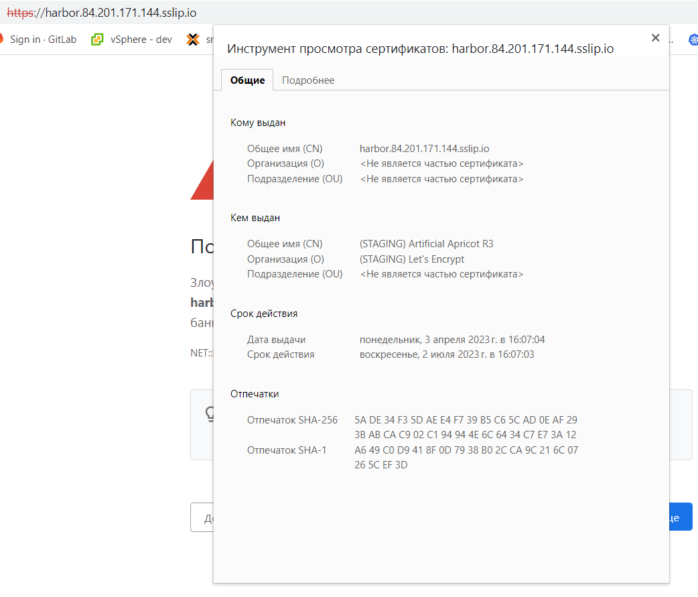

## ДЗ по теме Шаблонизация манифестов Kubernetes

ДЗ будет сделано на кластре kubernetes в яндекс обалке.

Ставим Helm 3 версии, проверяем успешность установки:
```
PS C:\Users\kurochkin.k> helm.exe version
version.BuildInfo{Version:"v3.11.2", GitCommit:"912ebc1cd10d38d340f048efaf0abda047c3468e", GitTreeState:"clean", GoVersion:"go1.18.10"}
```

Добавляем репозиторий stable (репо https://kubernetes-charts.storage.googleapis.com больше недоступен,поэтому ставим рекоммендованный репо) и проверяем что все ок:
```
PS C:\Users\kurochkin.k> helm repo add stable https://kubernetes-charts.storage.googleapis.com
Error: repo "https://kubernetes-charts.storage.googleapis.com" is no longer available; try "https://charts.helm.sh/stable" instead

PS C:\Users\kurochkin.k> helm repo add stable "https://charts.helm.sh/stable"
"stable" has been added to your repositories

PS C:\Users\kurochkin.k> helm repo list
NAME    URL
bitnami https://charts.bitnami.com/bitnami
stable  https://charts.helm.sh/stable
```

Создадим namespace и release nginx-ingress

```
kubectl create ns nginx-ingress

PS C:\Users\kurochkin.k> helm repo add nginx-stable https://helm.nginx.com/stable
"nginx-stable" has been added to your repositories
PS C:\Users\kurochkin.k> helm upgrade --install nginx-ingress nginx-stable/nginx-ingress --namespace=nginx-ingress
Release "nginx-ingress" does not exist. Installing it now.
NAME: nginx-ingress
LAST DEPLOYED: Mon Apr  3 10:46:48 2023
NAMESPACE: nginx-ingress
STATUS: deployed
REVISION: 1
TEST SUITE: None
NOTES:
The NGINX Ingress Controller has been installed.

NAME    NAMESPACE       REVISION        UPDATED STATUS  CHART   APP VERSION
PS C:\Users\kurochkin.k> helm.exe list -a -A
NAME            NAMESPACE       REVISION        UPDATED                                 STATUS          CHART                   APP VERSION
nginx-ingress   nginx-ingress   1               2023-04-03 10:56:29.8064023 +0300 MSK   deployed        nginx-ingress-0.17.0    3.1.0
```

### cert-manager

Ставим cert-manager
```
PS C:\Users\kurochkin.k> helm repo add jetstack https://charts.jetstack.io
"jetstack" has been added to your repositories

PS C:\Users\kurochkin.k> kubectl apply -f https://github.com/cert-manager/cert-manager/releases/download/v1.11.0/cert-manager.crds.yaml
customresourcedefinition.apiextensions.k8s.io/clusterissuers.cert-manager.io created
customresourcedefinition.apiextensions.k8s.io/challenges.acme.cert-manager.io created
customresourcedefinition.apiextensions.k8s.io/certificaterequests.cert-manager.io created
customresourcedefinition.apiextensions.k8s.io/issuers.cert-manager.io created
customresourcedefinition.apiextensions.k8s.io/certificates.cert-manager.io created
customresourcedefinition.apiextensions.k8s.io/orders.acme.cert-manager.io create


PS C:\Users\kurochkin.k> helm install cert-manager jetstack/cert-manager --namespace cert-manager --create-namespace --version v1.11.0
NAME: cert-manager
LAST DEPLOYED: Mon Apr  3 11:05:10 2023
NAMESPACE: cert-manager
STATUS: deployed
REVISION: 1
TEST SUITE: None
NOTES:
cert-manager v1.11.0 has been deployed successfully!

In order to begin issuing certificates, you will need to set up a ClusterIssuer
or Issuer resource (for example, by creating a 'letsencrypt-staging' issuer).

More information on the different types of issuers and how to configure them
can be found in our documentation:

https://cert-manager.io/docs/configuration/

For information on how to configure cert-manager to automatically provision
Certificates for Ingress resources, take a look at the `ingress-shim`
documentation:

https://cert-manager.io/docs/usage/ingress/
```

Для корректной работы cert-manager необходим ресурс [ClusterIssuer.yaml](cert-manager/ClusterIssuer.yaml) 

Для того чтобы заработал деплой helm-чарта chartmuseum, необходимо его выкачать и поправить yaml описывающий ресурс ingress, так как мы используем более новую версию кластера кубера:
```
{{- if .Values.ingress.enabled }}
{{- $servicePort := .Values.service.externalPort -}}
{{- $serviceName := include "chartmuseum.fullname" . -}}
{{- $ingressExtraPaths := .Values.ingress.extraPaths -}}
---
apiVersion: networking.k8s.io/v1
kind: Ingress
metadata:
  name: {{ include "chartmuseum.fullname" . }}
  annotations:
{{ toYaml .Values.ingress.annotations | indent 4 }}
  labels:
{{- if .Values.ingress.labels }}
{{ toYaml .Values.ingress.labels | indent 4 }}
{{- end }}
{{ include "chartmuseum.labels.standard" . | indent 4 }}
spec:
  rules:
  {{- range .Values.ingress.hosts }}
  - host: {{ .name }}
    http:
      paths:
      {{- range $ingressExtraPaths }}
      - path: {{ default "/" .path | quote }}
        pathType: Prefix
        backend:
          service:
            name: {{ $.Values.service.servicename }}
            port:
              number: {{ default $servicePort .port }}
      {{- end }}
      - path: {{ default "/" .path | quote }}
        pathType: Prefix
        backend:
          service:
            name: {{ $.Values.service.servicename }}
            name: {{ default $serviceName .service }}
            port:
              number: {{ default $servicePort .servicePort }}
  {{- end }}
  tls:
  {{- range .Values.ingress.hosts }}
  {{- if .tls }}
  - hosts:
    - {{ .name }}
    secretName: {{ .tlsSecret }}
  {{- end }}
  {{- end }}
{{- end -}}
```

После этого деплоим чарт:
```
PS C:\Users\kurochkin.k\Documents\repository_otus\2kw92_platform\kubernetes-templating> helm upgrade --install chartmuseum C:\Users\kurochkin.k\Documents\charts\chartmuseum\ --namespace=chartmuseum -f .\chartmuseum\values.yaml

WARNING: This chart is deprecated
Release "chartmuseum" has been upgraded. Happy Helming!
NAME: chartmuseum
LAST DEPLOYED: Mon Apr  3 13:45:52 2023
NAMESPACE: chartmuseum
STATUS: deployed
REVISION: 3
TEST SUITE: None
NOTES:
** Please be patient while the chart is being deployed **

Get the ChartMuseum URL by running:

  export POD_NAME=$(kubectl get pods --namespace chartmuseum -l "app=chartmuseum" -l "release=chartmuseum" -o jsonpath="{.items[0].metadata.name}")
  echo http://127.0.0.1:8080/
  kubectl port-forward $POD_NAME 8080:8080 --namespace chartmuseum
```

Проверяем с помощью Lens все ли окей:


Видим что LB балансирует нас нас по адресу сервиса nginx-ingress-controller, так что все ок.


### harbor

Далее ставим harbor и пробрасываем для него ingress [values.yaml](harbor/values.yaml)
Но валидный сертфиикат не получилось получить [ClusterIssuer.yaml](cert-manager/ClusterIssuer.yaml)
Использовались параметры удоствоеряющего сервера 
```
https://acme-staging-v02.api.letsencrypt.org/directory:
```
Поучали такую картину:


Использовались параметры удоствоеряющего сервера 
```
https://acme-v02.api.letsencrypt.org/directory:
```
Поучали такую картину:


Видим, что сертификат подтягивается, но почему он не валидный остается вопросом

А в целом harbor работоспособен:


### Создаем свой helm chart

```
PS C:\Users\kurochkin.k\Documents\repository_otus\2kw92_platform\kubernetes-templating> helm create hipster-shop
Creating hipster-shop
```

Установим наше приложение из одного 
```
PS C:\Users\kurochkin.k\Documents\repository_otus\2kw92_platform\kubernetes-templating> helm upgrade --install hipster-shop hipster-shop --namespace hipster-shop
Release "hipster-shop" does not exist. Installing it now.
NAME: hipster-shop
LAST DEPLOYED: Mon Apr  3 17:55:25 2023
NAMESPACE: hipster-shop
STATUS: deployed
REVISION: 1
TEST SUITE: None
```

После этого произведем манипуляции по шаблонизации нашего приложения и обновим зависимости:
```
PS C:\Users\kurochkin.k\Documents\repository_otus\2kw92_platform\kubernetes-templating> helm dep update hipster-shop
Hang tight while we grab the latest from your chart repositories...
...Successfully got an update from the "chartmuseum" chart repository
...Successfully got an update from the "harbor" chart repository
...Successfully got an update from the "jetstack" chart repository
...Successfully got an update from the "nginx-stable" chart repository
...Successfully got an update from the "bitnami" chart repository
...Successfully got an update from the "stable" chart repository
Update Complete. ⎈Happy Helming!⎈
Saving 1 charts
Deleting outdated charts
```
В директории kubernetes-templating/hipster-shop/charts появился архив frontend-0.1.0.tgz содержащий chart frontend определенной версии и добавленный в chart hipster-shop как зависимость.

После этого обновляем helm chart hipster-shop
```
PS C:\Users\kurochkin.k\Documents\repository_otus\2kw92_platform\kubernetes-templating> helm upgrade --install hipster-shop hipster-shop --namespace hipster-shop
Release "hipster-shop" does not exist. Installing it now.
NAME: hipster-shop
LAST DEPLOYED: Tue Apr  4 10:45:01 2023
NAMESPACE: hipster-shop
STATUS: deployed
REVISION: 1
TEST SUITE: None
```

Вес успешно обновилось. Проверяем статус подов:
```
PS C:\Users\kurochkin.k\Documents\repository_otus\2kw92_platform\kubernetes-templating> kubectl.exe get pods -n hipster-shop
NAME                                     READY   STATUS         RESTARTS       AGE
cartservice-65cf6686f9-76pfw             1/1     Running        1 (104s ago)   112s
checkoutservice-5b46dfd9bb-m8bf8         1/1     Running        0              113s
currencyservice-5fbf6cfcc6-txnj4         1/1     Running        0              113s
emailservice-86bfdd6b48-6cvff            1/1     Running        0              113s
frontend-69c6ff75c7-bzrxd                1/1     Running        0              113s
paymentservice-7f5f948b86-dn4xz          1/1     Running        0              113s
productcatalogservice-7bf75c85b8-wwnww   1/1     Running        0              113s
recommendationservice-5bcf9f88c6-n924s   1/1     Running        0              113s
redis-cart-78746d49dc-vdtlj              1/1     Running        0              113s
shippingservice-6c7b98898b-rglct         1/1     Running        0              113s
```

Видим что frontend успещно запущен.

Изменим параметры с помощью ключа --set

```
PS C:\Users\kurochkin.k\Documents\repository_otus\2kw92_platform\kubernetes-templating> helm upgrade --install hipster-shop hipster-shop --namespace hipster-shop --set frontend.service.NodePort=31234
Release "hipster-shop" has been upgraded. Happy Helming!
NAME: hipster-shop
LAST DEPLOYED: Tue Apr  4 11:05:06 2023
NAMESPACE: hipster-shop
STATUS: deployed
REVISION: 2
TEST SUITE: None
PS C:\Users\kurochkin.k\Documents\repository_otus\2kw92_platform\kubernetes-templating> kubectl.exe --namespace hipster-shop get svc frontend
NAME       TYPE       CLUSTER-IP      EXTERNAL-IP   PORT(S)        AGE
frontend   NodePort   10.96.237.105   <none>        80:31234/TCP   8m50s
```
Видим что изменения прошли успешно.


### Kubecfg


