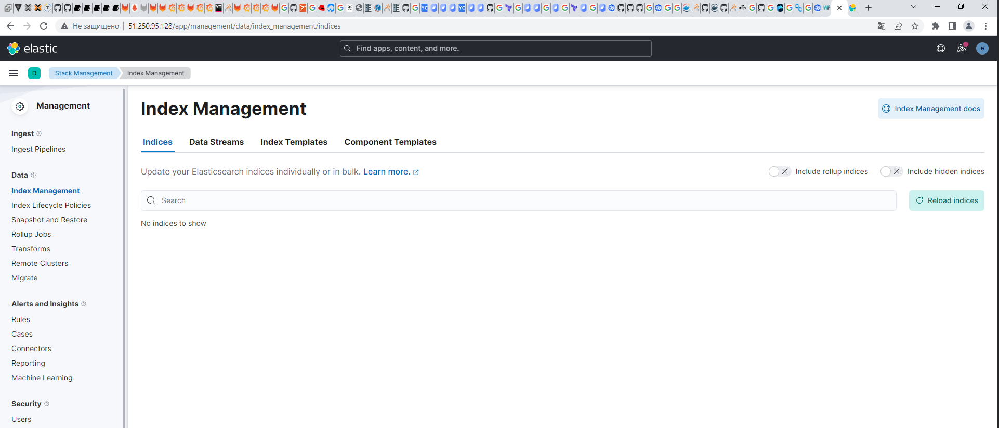

## ДЗ по теме Сервисы централизованного логирования для компонентов Kubernetes и приложений

ДЗ будет сделано на кластере kubernetes в яндекс облаке.

Разворачиваем с помощью [терраформа](https://github.com/2kw92/virtual_machine/blob/main/terraform/kuber/kuber.tf) кластер из 4 узлов

```
PS C:\Users\kurochkin.k\Documents\repository_otus\virtual_machine\terraform\kuber> kubectl.exe get nodes
NAME             STATUS   ROLES    AGE     VERSION
terraform-vm-1   Ready    <none>   2m23s   v1.24.6
terraform-vm-2   Ready    <none>   3m4s    v1.24.6
terraform-vm-3   Ready    <none>   2m48s   v1.24.6
terraform-vm-4   Ready    <none>   2m45s   v1.24.6
```

Присвоим нодам (terraform-vm-2,terraform-vm-3,terraform-vm-4) определенный taint, чтобы избежать запуска на них случайных pod
```
PS C:\Users\kurochkin.k\Documents\repository_otus\virtual_machine\terraform\kuber> kubectl taint nodes terraform-vm-2 key1=value1:NoSchedule
node/terraform-vm-2 tainted
PS C:\Users\kurochkin.k\Documents\repository_otus\virtual_machine\terraform\kuber> kubectl taint nodes terraform-vm-3 key1=value1:NoSchedule
node/terraform-vm-3 tainted
PS C:\Users\kurochkin.k\Documents\repository_otus\virtual_machine\terraform\kuber> kubectl taint nodes terraform-vm-4 key1=value1:NoSchedule
node/terraform-vm-4 tainted
```

Для начала, установим в Kubernetes кластер уже знакомый нам HipsterShop. Самый простой способ сделать это - применить подготовленный манифест:

```
PS C:\Users\kurochkin.k\Documents\repository_otus\virtual_machine\terraform\kuber> kubectl create ns microservices-demo
namespace/microservices-demo created
PS C:\Users\kurochkin.k\Documents\repository_otus\virtual_machine\terraform\kuber> kubectl apply -f https://raw.githubusercontent.com/express42/otus-platform-snippets/master/Module-02/Logging/microservices-demo-without-resources.yaml -n microservices-demo
deployment.apps/emailservice created
service/emailservice created
deployment.apps/checkoutservice created
service/checkoutservice created
deployment.apps/recommendationservice created
service/recommendationservice created
deployment.apps/frontend created
service/frontend created
service/frontend-external created
deployment.apps/paymentservice created
service/paymentservice created
deployment.apps/productcatalogservice created
service/productcatalogservice created
deployment.apps/cartservice created
service/cartservice created
deployment.apps/loadgenerator created
deployment.apps/currencyservice created
service/currencyservice created
deployment.apps/shippingservice created
service/shippingservice created
deployment.apps/redis-cart created
service/redis-cart created
deployment.apps/adservice created
service/adservice created
```

Все поды развернулись на первой ноде:
```
PS C:\Users\kurochkin.k\Documents\repository_otus\virtual_machine\terraform\kuber> kubectl get pods -n microservices-demo -o wide
NAME                                     READY   STATUS             RESTARTS        AGE   IP              NODE             NOMINATED NODE   READINESS GATES
adservice-58f8655b97-mhjpj               0/1     ImagePullBackOff   0               11m   10.112.131.15   terraform-vm-1   <none>           <none>
cartservice-6f6b5b875d-vg4z9             1/1     Running            2 (10m ago)     11m   10.112.131.10   terraform-vm-1   <none>           <none>
checkoutservice-b5545dc95-w4rr9          1/1     Running            0               11m   10.112.131.5    terraform-vm-1   <none>           <none>
currencyservice-f7b9cc-89q6h             1/1     Running            0               11m   10.112.131.12   terraform-vm-1   <none>           <none>
emailservice-59954c6bff-cwn7l            1/1     Running            0               11m   10.112.131.4    terraform-vm-1   <none>           <none>
frontend-75f46fcfb7-sbfr6                1/1     Running            0               11m   10.112.131.7    terraform-vm-1   <none>           <none>
loadgenerator-7d88bdbbf8-8fzrj           1/1     Running            4 (9m15s ago)   11m   10.112.131.11   terraform-vm-1   <none>           <none>
paymentservice-556f7b5695-5rp7q          1/1     Running            0               11m   10.112.131.8    terraform-vm-1   <none>           <none>
productcatalogservice-78854d86ff-cczz7   1/1     Running            0               11m   10.112.131.9    terraform-vm-1   <none>           <none>
recommendationservice-b8f974fc-vcg4t     1/1     Running            0               11m   10.112.131.6    terraform-vm-1   <none>           <none>
redis-cart-745456dd9b-9xgln              1/1     Running            0               11m   10.112.131.14   terraform-vm-1   <none>           <none>
shippingservice-7b5695bdb5-gw7vx         1/1     Running            0               11m   10.112.131.13   terraform-vm-1   <none>           <none>
```

### Установка EFK стека | Helm charts

Так как репа недоступна, выкаем исходники и будем ставить из них
```
root@ubuntu-otus:~/otus_kuber/lessons-9-kubernetes-logging# helm upgrade --install elasticsearch helm-charts-main/elasticsearch --set imageTag=8.5.1 -n observability
Release "elasticsearch" has been upgraded. Happy Helming!
NAME: elasticsearch
LAST DEPLOYED: Fri Apr 28 08:40:22 2023
NAMESPACE: observability
STATUS: deployed
REVISION: 3
NOTES:
1. Watch all cluster members come up.
  $ kubectl get pods --namespace=observability -l app=elasticsearch-master -w
2. Retrieve elastic user's password.
  $ kubectl get secrets --namespace=observability elasticsearch-master-credentials -ojsonpath='{.data.password}' | base64 -d
3. Test cluster health using Helm test.
  $ helm --namespace=observability test elasticsearch

PS C:\Users\kurochkin.k\Documents\repository_otus\2kw92_platform\kubernetes-operators\deploy> helm upgrade --install fluent-bit stable/fluent-bit --namespace observability
Release "fluent-bit" does not exist. Installing it now.
WARNING: This chart is deprecated
NAME: fluent-bit
LAST DEPLOYED: Fri Apr 28 11:45:36 2023
NAMESPACE: observability
STATUS: deployed
REVISION: 1
NOTES:
fluent-bit is now running.

It will forward all container logs to the svc named fluentd on port: 24284
```

Если посмотреть, как установленные нами сервисы распределились по нодам, можно догадаться, что что-то пошло не по плану, все сервисы с  
переменным успехом попытались запуститься только на одной ноде terraform-vm-1. Исправим это используя ключ `tolerations`

Раздадим метки нодам:
```
root@ubuntu-otus:~/otus_kuber/lessons-9-kubernetes-logging# kubectl label nodes terraform-vm-2 node=node_infra
node/terraform-vm-2 labeled
root@ubuntu-otus:~/otus_kuber/lessons-9-kubernetes-logging# kubectl label nodes terraform-vm-3 node=node_infra
node/terraform-vm-3 labeled
root@ubuntu-otus:~/otus_kuber/lessons-9-kubernetes-logging# kubectl label nodes terraform-vm-4 node=node_infra
node/terraform-vm-4 labeled
```

И пропишем в values

```
tolerations:
  - key: key1
    operator: Equal
    value: value1
    effect: NoSchedule

nodeAffinity:
  preferredDuringSchedulingIgnoredDuringExecution:
  - weight: 1
    preference:
      matchExpressions:
      - key: node
        operator: In
        values:
        - node_infra
```

Для того чтобы поднять elasticsearch в яндекс облаке пришлось выкачить образ с официальной репы с включенным впн, затем  
положить в свой registry
```
docker pull docker.elastic.co/elasticsearch/elasticsearch:8.7.0
docker tag fd60cca4e217:8.7.0 2kw92/elasticsearch:8.7.0
docker push 2kw92/elasticsearch:8.7.0
```

и поправить в values `image`
```
image: "2kw92/elasticsearch"
imageTag: "8.7.0"
imagePullPolicy: "IfNotPresent"
```

Все прошло успешно и наблюдаем следующую картину:
```
root@ubuntu-otus:~/otus_kuber/lessons-9-kubernetes-logging# kubectl get pods -n observability -o wide -l chart=elasticsearch
NAME                     READY   STATUS    RESTARTS   AGE     IP             NODE             NOMINATED NODE   READINESS GATES
elasticsearch-master-0   1/1     Running   0          5m43s   10.112.130.9   terraform-vm-2   <none>           <none>
elasticsearch-master-1   1/1     Running   0          5m43s   10.112.131.8   terraform-vm-4   <none>           <none>
elasticsearch-master-2   1/1     Running   0          5m43s   10.112.129.8   terraform-vm-3   <none>           <none>
```

### Установка nginx-ingress

```
 helm repo add ingress-nginx https://kubernetes.github.io/ingress-nginx && \
> helm repo update && \
> helm install ingress-nginx ingress-nginx/ingress-nginx
```

Должно быть развернуто три реплики controller, по одной, на каждую ноду: для этого  
используем файл ingress.values.yaml со следующим содержимым:
```
controller:
  replicaCount: 3

  tolerations:
    - key: key1
      operator: Equal
      value: value1
      effect: NoSchedule

  affinity:
    podAntiAffinity:
      preferredDuringSchedulingIgnoredDuringExecution:
      - weight: 100
        podAffinityTerm:
          labelSelector:
            matchExpressions:
            - key: app
              operator: In
              values:
              - nginx-ingress
            - key: node
              operator: In
              values:
              - node_infra
          topologyKey: kubernetes.io/hostname
```

И применим его при обнолении helm
```
helm upgrade --install ingress-nginx ingress-nginx/ingress-nginx -f ingress.values.yaml
```

Убедимся что все ок
```
root@ubuntu-otus:~/otus_kuber/lessons-9-kubernetes-logging# kubectl get pods -o wide
NAME                                        READY   STATUS    RESTARTS   AGE   IP              NODE             NOMINATED NODE   READINESS GATES
ingress-nginx-controller-7754d45dfc-m5x5x   1/1     Running   0          11m   10.112.130.10   terraform-vm-2   <none>           <none>
ingress-nginx-controller-7754d45dfc-nnhm7   1/1     Running   0          10m   10.112.129.9    terraform-vm-3   <none>           <none>
ingress-nginx-controller-7754d45dfc-x9hzc   1/1     Running   0          10m   10.112.131.9    terraform-vm-4   <none>           <none>
```

После этого ставим kibana и ingress для нее:
```
root@ubuntu-otus:~/otus_kuber/lessons-9-kubernetes-logging# helm upgrade --install kibana helm-charts-main/kibana -n observability -f  helm-charts-main/kibana/kibana.values.yaml
Release "kibana" does not exist. Installing it now.
NAME: kibana
LAST DEPLOYED: Thu May  4 08:52:23 2023
NAMESPACE: observability
STATUS: deployed
REVISION: 1
TEST SUITE: None
NOTES:
1. Watch all containers come up.
  $ kubectl get pods --namespace=observability -l release=kibana -w
2. Retrieve the elastic user's password.
  $ kubectl get secrets --namespace=observability elasticsearch-master-credentials -ojsonpath='{.data.password}' | base64 -d
3. Retrieve the kibana service account token.
  $ kubectl get secrets --namespace=observability kibana-kibana-es-token -ojsonpath='{.data.token}' | base64 -d
```

Пример файла для ingress

```
apiVersion: networking.k8s.io/v1
kind: Ingress
metadata:
  name: minimal-ingress
  namespace: observability
  annotations:
    kubernetes.io/ingress.class: "nginx"
spec:
  rules:
    - host:
      http:
        paths:
        - path: /
          pathType: Prefix
          backend:
            service:
              name: kibana-kibana
              port:
                number: 5601
```

```
root@ubuntu-otus:~/otus_kuber/lessons-9-kubernetes-logging# kubectl apply -f ingress.yaml
ingress.networking.k8s.io/minimal-ingress configured
```

И проверяем что все доступно и обнаруживаем что при создании index pattern нету данных:

